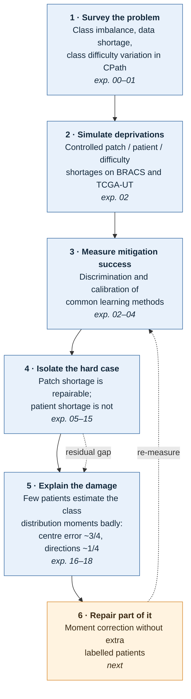

# master-thesis

Controlled patch-classification studies on frozen Virchow2 features (BRACS, TCGA-UT).

## Research direction



Per-experiment questions and results: [`experiments/AGENTS.md`](experiments/AGENTS.md).

## Key paths

| Path | Purpose |
|---|---|
| `experiments/` | Numbered experiments and reports (summary: `experiments/CLAUDE.md`) |
| `papers/` | PDFs by topic, `sources.bib` bibliography |
| `docs/` | Thesis reference PDFs, glossary, FAQ |
| `meetings/` | Meeting notes by date |
| `CLUSTER.md` | Hydra cluster runbook (SSH, SLURM, storage) |
| `CLAUDE.md` / `AGENTS.md` | Agent instructions |
| `.agents/skills/` | Repo-local agent skills (`bib`, `scientific-writing`, `notebooklm`, `hydra-cluster`) |

## Setup

```bash
uv sync   # Python 3.12+, installs package + exposes `bib` CLI
```
